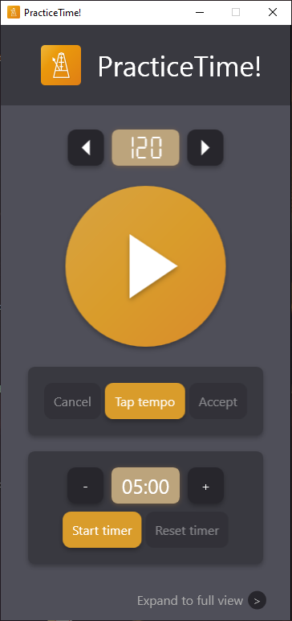
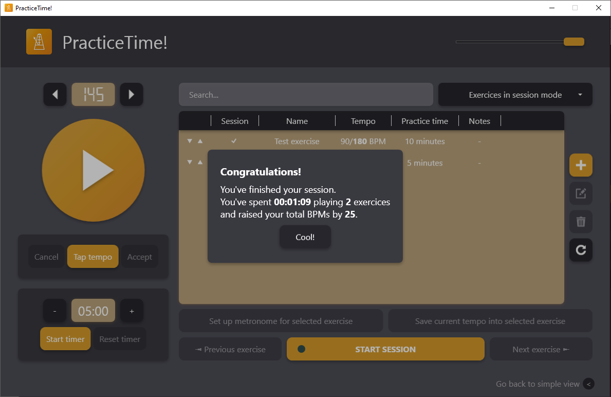

# PracticeTime!

PracticeTime is versatile metronome app with session planning functionality.

## Features
* A metronome that can play within range from 40 to 300 BPM
* Tap tempo
* Timer
* Storing data about exercises
* Training session - allows you to concentrate on playing your instrument, as the metronome settings change automatically.

## Screenshots

## Setup
Just download the installer and install the app.

## Versions
### 1.0.1
Minor bug fixes and improvements.

### 1.0.0-alpha
Initial release.

## Technologies
* WPF
* C#
* NAudio library
* SQLite
